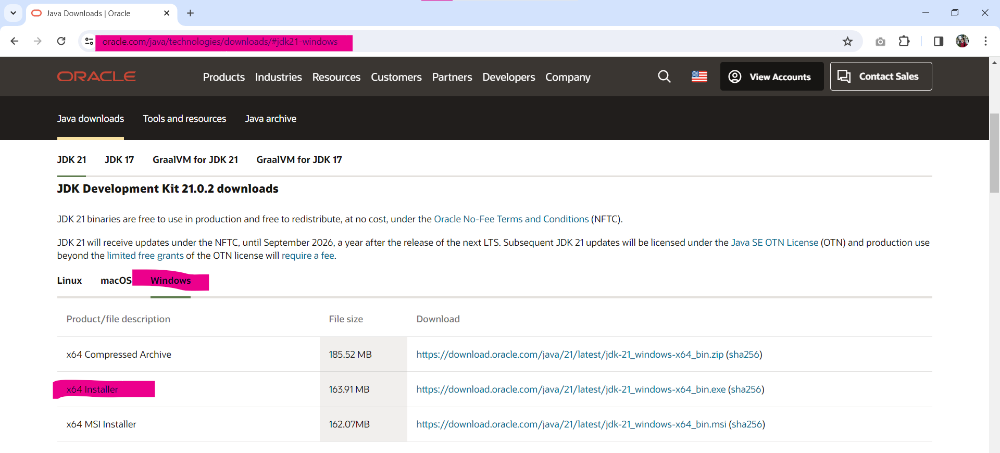

# javaFx
Learn javaFx with Rony Ahmmed

# How to start java
### 1. open your computer create a new foder and save it in a safe zone (don't edit or mix other file)

example: javaAll

## Download items
<ul>
    
### Go to this web sites and download this file

<li> 2.1 JDK (x64 Installer) [java2.1.png] </li>
link <a href="https://www.oracle.com/java/technologies/downloads/#jdk21-windows">Download</a>
 

<li>2.2 Apache NetBeans 20 [java2.2.png]</li>
link <a href="https://netbeans.apache.org/front/main/download/index.html">Download</a>
 

<li>2.3 javaFX azul [java2.3.png]</li>
link <a href="https://www.azul.com/downloads/?version=java-21-lts&os=windows&architecture=x86-64-bit&package=jdk-fx#zulu">Download</a>
 

<li>2.4 javaFX lib [java2.4.png]</li>
link <a href="https://gluonhq.com/products/javafx/">Download</a>
 

<li>2.5 Download Scene Builder [java2.5.png]</li>
link <a href="https://gluonhq.com/products/scene-builder/">Download</a>
 

